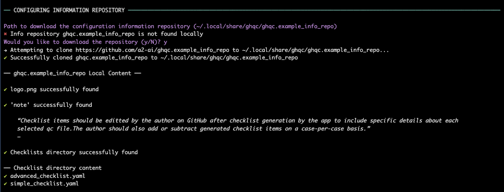
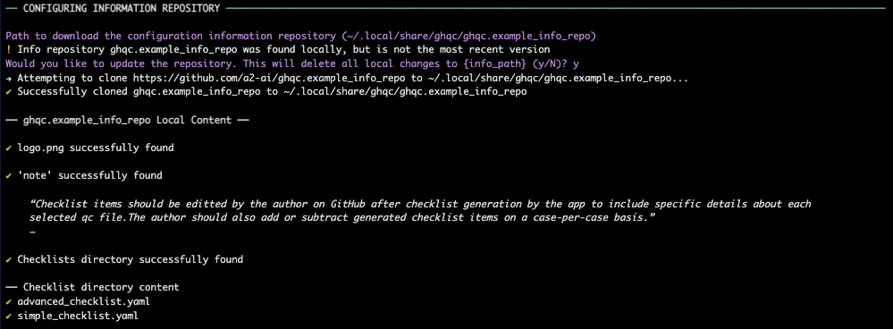
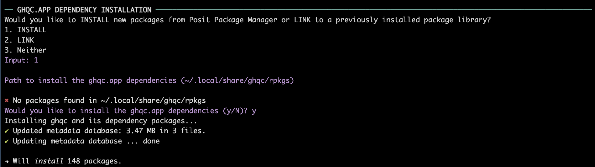
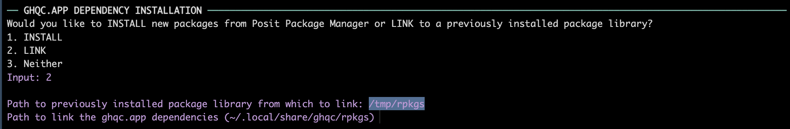

<!-- README.md is generated from README.Rmd. Please edit that file -->

# ghqc <a href="https://github.com/a2-ai/ghqc/"></a>

<!-- badges: start -->

[](https://github.com/A2-ai/ghqc/actions/workflows/R-CMD-check.yaml)
<!-- badges: end -->

The goal of the ghqc ecosystem is to simplify, standardize, and improve
traceability of the QC process through the use of shiny apps which
create GitHub Issues and Milestones for your project. The ghqc package
is a lightweight wrapper to be installed alongside project packages and
has three primary functionalities:

- **Isolating Package Dependency**: Installs, or symlinks, the high
  dependency burden of the ghqc shiny app ecosystem to an isolated
  directory to ensure no interference with any project work.

- **Launching Shiny Apps**: Launches the ghqc shiny apps as background
  jobs to allow for continued use of the R Console.

- **Verifying Configuring Information**: Aids in the installation and
  structure verification of the organization specific configuring
  information, such as checklists and logos.

## Installation

You can install the development version of ghqc from
[GitHub](https://github.com/) with:

``` r
# install.packages("pak")
pak::pak("a2-ai/ghqc")
```

## Interacting with ghqc

``` r
library(ghqc)
```

## Configuration Information Repository

The ghqc ecosystem has been developed with the intent organizations can
customize elements of the QC process. Currently, the customizable
elements are:

- **Checklists**: yaml files contained within a directory named
  “checklist” *(required)*

- **Prepended Note**: A note to prepend to all checklists named “note”
  *(optional)*

- **Logo**: A logo to be included in the header of the resultant
  record’s header named as “logo.png” *(required)*

An example structure of the configuration information repository can be
found at
[github.com/A2-ai/ghqc.example_info_repo](https://github.com/A2-ai/ghqc.example_info_repo).

## ghqc Setup

ghqc has 3 main requirements that must be met before running any of the
ghqc ecosystem apps:

1.  An environmental variable, `GHQC_INFO_REPO`, must be set to the
    configuration information repository url in “~/.Renviron”.

2.  The configuration information repository must be downloaded to a
    local location.

3.  All of the dependency packages for the ghqc shiny apps, including
    `ghqc.app` must be located in the same directory.

Within this package, a function `ghqc::setup_ghqc()` aids in this setup:

``` r
ghqc::setup_ghqc()
```

1.  **Renviron Setup**

Enter the url of the configuration information repository described
above.


2.  **Configuration Information Download and Verification**

The configuration information will default to installing to
“~/.local/share/ghqc/<repo_name>”. To download to the default location,
which is highly recommended, hit `ENTER`. Otherwise, type in the path in
which to download the repository.

In addition to downloading the repository, the structure of the
repository and the checklist yamls are verified.



In the case the configuration information repository has already been
downloaded to the specified path and their are remote changes to the
repository, the user will be warned and provided the option to download
the new update.

<figure>

<figcaption aria-hidden="true">NOTE: This will remove all local changes
to the repository and hard reset to the content in the
remote.</figcaption>
</figure>


3.  **Shiny App Dependency Installation**

Select whether to install the dependency packages or symlink to
previously a previously installed package library.

- INSTALL PACKAGES

  - NOTE: The install option is currently only available to linux
    systems supported by Posit Package Manager (PPM) and will install
    from
    [PPM@2024-03-01](https://packagemanager.posit.co/cran/2024-03-01).

  - The dependency packages are installed by default to
    “~/.local/share/ghqc/rpkgs”. To install to the default location,
    which is highly recommended, hit `ENTER`. Otherwise, type in the
    path in which to install the dependency packages.

  

- SYMLINK PACKAGES

  - NOTE: The link option requires all packages be installed in the same
    `link_path` AND they meet the requirements listed in the imports.

  - Provide the path to the previously installed package library.

  - The dependency packages are symlinked by default to
    “~/.local/share/ghqc/rpkgs”. To symlink to the default location,
    which is highly recommended, hit `ENTER`. Otherwise, type in the
    path in which to download the repository.

  

#### ghqc.app installation

NOTE: `ghqc::ghqc_setup()` does not install the `ghqc.app` package as
the distribution method and/or required version may change based on
organization needs.

You can install the development version of ghqc.app from
[GitHub](https://github.com/) with:

``` r
# install.packages("pak")
pak::pak("a2-ai/ghqc.app")
```

## ghqc shiny app launching

ghqc will start a background job to launch an app from the ghqc
ecosystem into the “Viewer” pane of your RStudio session. For technical
information regarding these apps, refer to
[ghqc.app](https://github.com/a2-ai/ghqc.app).

…
