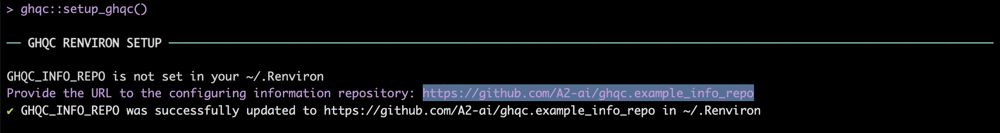

<!-- README.md is generated from README.Rmd. Please edit that file -->

# ghqc <a href="https://github.com/a2-ai/ghqc/"></a>

<!-- badges: start -->

[](https://github.com/A2-ai/ghqc/actions/workflows/R-CMD-check.yaml)
<!-- badges: end -->

The goal of the ghqc ecosystem is to simplify, standardize, and improve
traceability of the QC process through the use of shiny apps which
create GitHub Issues and Milestones for your project. The ghqc package
is a lightweight wrapper to be installed along side project packages and
has three primary functionalities:

- **Isolating Package Dependency**: Installs, or symlinks, the high
  dependency burden of the ghqc shiny app ecosystem to an isolated
  directory to ensure no interference with any project work.

- **Launching Shiny Apps**: Launches the ghqc shiny apps as background
  jobs to allow for continued use of the R Console

- **Verifying Configuring Information**: Aids in the installation and
  structure verification of the organization specific configuring
  information, such as checklists and logos.

## Installation

You can install the development version of ghqc from
[GitHub](https://github.com/) with:

``` r
# install.packages("pak")
pak::pak("a2-ai/ghqc")
```

## Interacting with ghqc

``` r
library(ghqc)
```

## Configuration Information Repository

The ghqc ecosystem has been developed with the intent organizations can
customize elements of the QC process. Currently, the customizable
elements are:

- **Checklists**: yaml files contained within a directory named
  “checklist” *(required)*

- **Prepended Note**: A note to prepend to all checklists named “note”
  *(optional)*

- **Logo**: A logo to be included in the header of the resultant
  record’s header named as “logo.png”

An example structure of the configuration information repository can be
found at
[github.com/a2-ai/ghqc.a2ai](https://github.com/a2-ai/ghqc.a2ai)

## ghqc Setup

ghqc has 3 main requirements that must be met before running any of the
ghqc ecosystem apps:

1.  An environmental variable, `GHQC_INFO_REPO`, must be set to the
    configuration information repository url in “~/.Renviron”.

2.  The configuration information repository must be downloaded to a
    local location.

3.  All of the dependency packages for the ghqc shiny apps, including
    `ghqc.app` must be located in the same directory.

Within this package, a function `ghqc::setup_ghqc()` aids in this setup.

``` r
ghqc::setup_ghqc()
```



…
